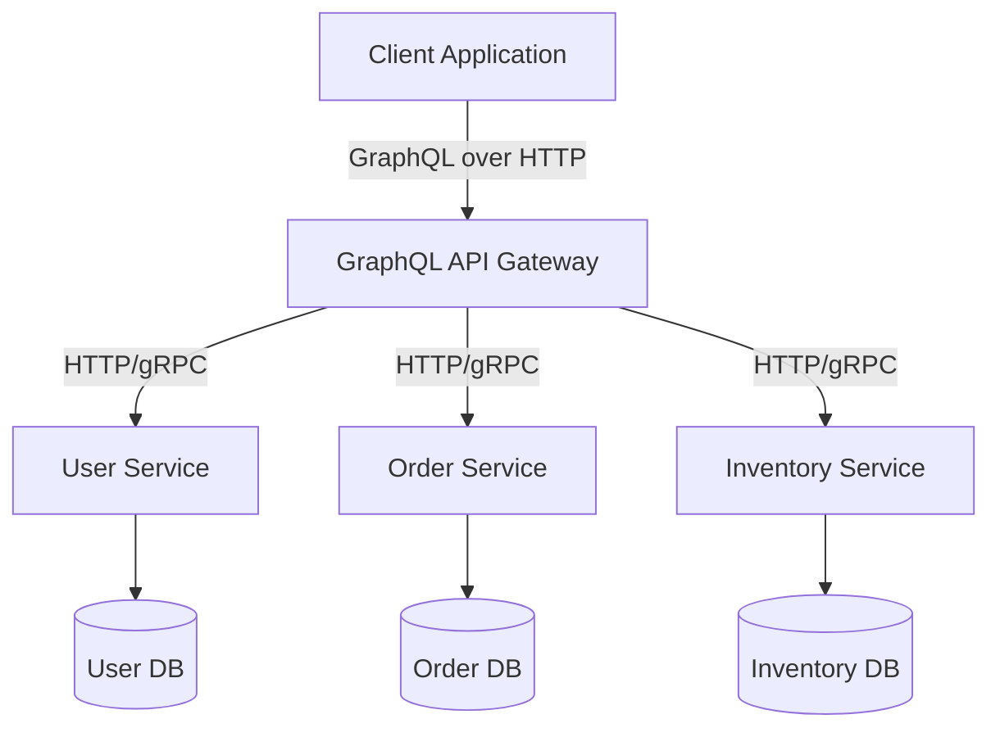
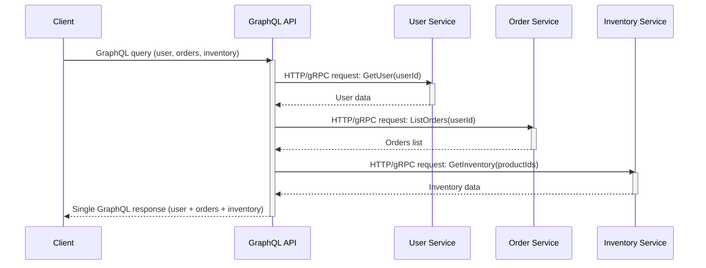

## Soal 2 – GraphQL dan Komunikasi Antar Proses dalam Sistem Terdistribusi

## 1. GraphQL dalam sistem terdistribusi

**GraphQL** adalah *query language* untuk API sekaligus *runtime* untuk mengeksekusi *query* tersebut terhadap data yang sudah ada. Dari sudut pandang *distributed system*, GraphQL umumnya berperan sebagai **gateway** atau **API facade**:

- Klien mengirim *GraphQL query*, *mutation*, atau *subscription* melalui HTTP (atau WebSocket untuk *real-time updates*).
- Sebuah **GraphQL server** terpusat (biasanya berjalan sebagai proses terpisah) menerima permintaan tersebut dan mengeksekusi **resolver**.
- Setiap resolver dapat memanggil satu atau lebih **backend service** (misalnya *microservice*, database, *message queue*, dan lain-lain).

GraphQL sendiri **bukan** *transport protocol* seperti TCP atau HTTP. GraphQL berjalan **di atas** *transport* yang sudah ada (umumnya HTTP) dan mendeskripsikan **data apa** yang diinginkan klien. Cara GraphQL server berkomunikasi dengan layanan lain itulah yang mewujudkan **inter-process communication (IPC)**.

---

## 2. GraphQL dan inter-process communication

Dalam arsitektur *microservice* terdistribusi, GraphQL server biasanya merupakan satu proses tersendiri yang harus berkomunikasi dengan banyak proses lain. Pola komunikasi yang umum meliputi:

- **Synchronous IPC** melalui HTTP atau gRPC (pola *request–response*):
  - Sebuah resolver memanggil endpoint REST pada `user-service` atau `order-service`.
  - Sebuah resolver memanggil metode gRPC yang diekspos oleh *microservice* lain.
- **Asynchronous IPC** melalui *message queue* atau *event stream*:
  - Sebuah *mutation* menerbitkan event ke Kafka, RabbitMQ, atau *message broker* lain.
  - Layanan lain mengonsumsi event tersebut dan memperbarui database miliknya sendiri.

Dari sudut pandang ini, setiap GraphQL resolver pada dasarnya adalah **composition layer** di atas mekanisme IPC yang lebih rendah:

- Klien hanya melihat sebuah **single query** dengan *strongly typed schema*.
- GraphQL server menerjemahkan *query* tersebut menjadi **multiple calls** ke berbagai backend service.
- Detail komunikasi antar layanan (protokol, jumlah panggilan, mekanisme *retry*, *circuit breaking*) disembunyikan di balik resolver.

### 2.1 Contoh: GraphQL sebagai API Gateway

Sebagai ilustrasi, pertimbangkan arsitektur sederhana berikut:

- Sebuah **client** (aplikasi web atau mobile) mengirim *GraphQL query* untuk mengambil profil pengguna beserta daftar *order* terbaru dan ketersediaan *inventory*.
- Sebuah **GraphQL API gateway** menerima *query* tersebut.
- Gateway memiliki sejumlah resolver yang memanggil tiga backend service:
  - `user-service` untuk detail pengguna.
  - `order-service` untuk daftar *order*.
  - `inventory-service` untuk informasi stok.

Di balik layar, setiap resolver bergantung pada IPC:

- Beberapa resolver memanggil endpoint HTTP (misalnya `GET /users/{id}`, `GET /orders?userId=` ...).
- Resolver lain dapat memanggil layanan gRPC atau membaca dari *cache*.

Namun dari sisi klien, hanya ada **satu** *GraphQL query* dan **satu** respons JSON yang sudah menggabungkan semua data dari berbagai layanan.

---

## 3. Diagram – GraphQL di atas IPC antar microservice

### 3.1 Component diagram

Diagram berikut menunjukkan bagaimana GraphQL berada di antara klien dan proses backend:

Hal-hal penting dari diagram tersebut:

- **GraphQL API Gateway** adalah proses tersendiri.
- Setiap backend service merupakan proses lain dengan database masing-masing.
- Komunikasi antara GraphQL dan layanan-layanan tersebut adalah **inter-process communication** (HTTP, gRPC, atau mekanisme RPC lainnya).

### 3.2 Sequence diagram

Sequence diagram berikut menggambarkan alur permintaan yang umum:

Diagram ini menunjukkan bagaimana satu operasi GraphQL secara logis *fan-out* menjadi beberapa **IPC call** ke backend service yang berbeda.

---

## 4. Manfaat penggunaan GraphQL di atas IPC

Ketika GraphQL digunakan sebagai *facade* di atas *inter-process communication*, terdapat beberapa keuntungan:

1. **Aggregation dan composition**
   - Klien dapat meminta data dari beberapa service dalam satu *query*.
   - Lapisan GraphQL menyusun (*compose*) respons akhir dari beberapa backend service.

2. **Client-driven data selection**
   - Klien memilih sendiri field apa saja yang diperlukan.
   - GraphQL server dapat menerjemahkan permintaan tersebut menjadi IPC call yang minimal atau *optimized query*.

3. **Schema sebagai kontrak**
   - *GraphQL schema* mendeskripsikan *domain model* dan operasi yang tersedia.
   - Backend service dapat berevolusi secara independen selama lapisan GraphQL masih dapat memenuhi kontrak schema tersebut.

4. **Decoupling dan evolusi**
   - Microservice dapat mengekspose REST/gRPC API internal yang dioptimalkan untuk konsumsi antarlayanan, bukan langsung untuk front-end.
   - Lapisan GraphQL memberikan kontrak yang stabil untuk klien, sambil mengizinkan perubahan di sisi internal service.

5. **Optimisasi performa**
   - GraphQL server dapat melakukan *batching* atau *caching* terhadap IPC call (misalnya menggunakan *data loader* untuk menggabungkan beberapa permintaan kecil menjadi satu permintaan yang lebih besar ke backend).

---

## 5. Ringkasan

- GraphQL bukan pengganti protokol IPC, tetapi merupakan **higher-level API layer** yang dibangun di atasnya.
- Dalam *distributed system*, GraphQL server sendiri adalah sebuah proses yang berpartisipasi dalam **inter-process communication** dengan banyak backend service.
- Setiap GraphQL resolver umumnya menggunakan IPC (HTTP, gRPC, messaging) untuk mengambil atau memodifikasi data pada proses lain.
- Dari sudut pandang klien, GraphQL menyembunyikan kompleksitas *distributed system* di belakang sebuah API tunggal yang fleksibel, sembari di sisi dalam sangat bergantung pada pola IPC.

