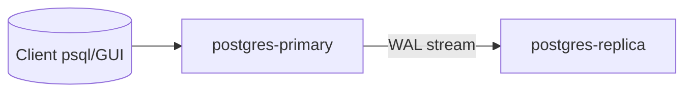

## Soal 3 – PostgreSQL Streaming Replication dengan Docker Compose

## 1. Tujuan dan gambaran umum

Tujuan latihan ini adalah menyiapkan **PostgreSQL streaming replication** menggunakan **Docker Compose**. Konfigurasi ini menunjukkan bagaimana perubahan yang ditulis pada *primary database instance* direplikasi secara otomatis ke *standby instance*, sehingga menjelaskan cara kerja sinkronisasi pada level *write-ahead log (WAL)*.

Pada konfigurasi ini digunakan arsitektur minimal dengan dua *container* PostgreSQL:

- `postgres-primary` – *server primary* yang menerima lalu lintas baca dan tulis.
- `postgres-replica` – *server standby* yang secara kontinu melakukan *streaming* catatan WAL dari primary.

Data yang ditulis pada primary akan direplikasi ke replica, sehingga replica dapat digunakan untuk *read-only query*.

---

## 2. Gambaran arsitektur

Gambaran arsitektur sistem adalah sebagai berikut:



Poin-poin penting dari arsitektur ini:

- Kedua container berjalan pada Docker network yang sama yang dibuat oleh Docker Compose.
- Primary dan replica tidak berbagi data directory secara langsung, tetapi data directory pada replica diinisialisasi menggunakan **base backup** dari primary.
- Setelah base backup selesai, replica dijalankan dalam **standby mode** dan secara kontinu menerima perubahan WAL dari primary (streaming replication).

---

## 3. Berkas pada direktori ini

Direktori ini berisi:

- `docker-compose.yml` – mendefinisikan service PostgreSQL untuk primary dan replica.
- `primary/init-primary.sql` – skrip SQL yang dijalankan pada *startup* pertama primary untuk membuat *replication user*.
- `primary/init-replication.sh` – skrip shell yang dijalankan saat inisialisasi primary untuk mengizinkan koneksi replikasi pada `pg_hba.conf`.
- `replica/init-replica.sh` – skrip shell yang dijalankan saat inisialisasi replica untuk:
  - Menunggu hingga primary siap.
  - Melakukan base backup dari primary ke data directory milik replica.
  - Mengonfigurasi replica agar dijalankan dalam standby mode.

Seluruh skrip di dalam `docker-entrypoint-initdb.d` akan dieksekusi secara otomatis selama proses **initialization** pertama database oleh *official PostgreSQL image*.

---

## 4. Gambaran konfigurasi Docker Compose

Secara garis besar, berkas `docker-compose.yml` melakukan hal-hal berikut:

- Mendefinisikan service `postgres-primary` dengan menggunakan official image `postgres:16`.
  - Mengatur environment variable untuk database, user, dan password awal.
  - Melakukan mount terhadap skrip inisialisasi untuk membuat **replication user** dan mengonfigurasi `pg_hba.conf`.
  - Menjalankan PostgreSQL dengan parameter replikasi yang sesuai (`wal_level`, `max_wal_senders`, dan seterusnya).
- Mendefinisikan service `postgres-replica` dengan image `postgres:16` yang sama.
  - Melakukan mount terhadap skrip inisialisasi yang akan:
    - Menunggu sampai primary dapat dijangkau.
    - Mengosongkan data directory pada replica.
    - Menjalankan `pg_basebackup` untuk menyalin data directory dari primary.
    - Menggunakan opsi `-R` sehingga replica dikonfigurasi untuk mulai sebagai streaming standby.
  - Mengekspos replica pada port yang berbeda sehingga kita dapat terhubung ke kedua instance dari host.

Kedua service menggunakan **named volumes** untuk data directory mereka sehingga data tetap persisten meskipun container dihentikan dan dijalankan kembali.

---

## 5. Langkah-langkah menjalankan

### 5.1 Menjalankan klaster

Dari direktori ini, jalankan PostgreSQL primary dan replica menggunakan Docker Compose:

```bash
docker compose up -d
```

(Jika instalasi Docker Anda masih menggunakan legacy plugin, Anda dapat menggunakan `docker-compose up -d` sebagai alternatif.)

Secara garis besar, Docker Compose akan melakukan:

1. Membuat container `postgres-primary`.
2. Menginisialisasi data directory pada primary.
3. Menjalankan `primary/init-primary.sql` dan `primary/init-replication.sh` pada saat startup pertama.
4. Membuat container `postgres-replica`.
5. Menginisialisasi data directory pada replica dan menjalankan `replica/init-replica.sh` yang melakukan base backup dari primary dan mengonfigurasi streaming replication.

Anda dapat memeriksa container yang berjalan dengan perintah:

```bash
docker ps
```

### 5.2 Menghubungkan ke primary

Untuk terhubung ke database pada primary dari host:

```bash
docker exec -it postgres-primary \
  psql -U app_user -d app_db
```

Di dalam `psql`, buat tabel sederhana dan masukkan satu baris data:

```sql
CREATE TABLE demo_replication (
    id SERIAL PRIMARY KEY,
    message TEXT NOT NULL,
    created_at TIMESTAMPTZ DEFAULT NOW()
);

INSERT INTO demo_replication (message) VALUES ('Hello from the primary');

SELECT * FROM demo_replication;
```

Anda seharusnya melihat satu baris data pada tabel tersebut.

### 5.3 Memverifikasi replikasi pada replica

Selanjutnya, terhubung ke replica:

```bash
docker exec -it postgres-replica \
  psql -U app_user -d app_db
```

Jalankan perintah `SELECT` yang sama pada replica:

```sql
SELECT * FROM demo_replication;
```

Anda seharusnya melihat **baris yang sama** dengan yang dimasukkan pada primary. Replica dikonfigurasi sebagai **read-only standby**, sehingga:

- Perintah `INSERT`, `UPDATE`, dan `DELETE` pada replica akan gagal.
- Perintah `SELECT` diperbolehkan dan membaca data hasil replikasi.

Perilaku ini menunjukkan bagaimana streaming replication bekerja:

- Primary menulis perubahan ke WAL.
- Catatan WAL tersebut dikirim (streamed) melalui jaringan ke replica.
- Replica memutar ulang (replay) WAL untuk memperbarui data directory lokal.

### 5.4 Menghentikan dan membersihkan

Untuk menghentikan container tanpa menghapus data volume:

```bash
docker compose down
```

Untuk menghentikan dan sekaligus menghapus volume (mengatur ulang klaster dari awal):

```bash
docker compose down -v
```

Setelah menjalankan `down -v`, perintah `docker compose up -d` berikutnya akan menginisialisasi ulang primary dan replica.

---

## 6. Cara kerja sinkronisasi pada konfigurasi ini

### 6.1 Konsep streaming replication

Streaming replication pada PostgreSQL dibangun di atas mekanisme **write-ahead logging (WAL)**:

1. Setiap perubahan pada database (INSERT, UPDATE, DELETE, DDL) pertama kali ditulis ke WAL.
2. Primary mengirim catatan WAL ke standby yang terhubung melalui koneksi TCP.
3. Standby menerima WAL dan melakukan replay untuk menerapkan perubahan tersebut ke data file lokal.

Secara umum terdapat dua mode replikasi utama:

- **Asynchronous replication** – Primary mengonfirmasi commit transaksi segera setelah catatan WAL ditulis secara lokal. Replica dapat mengalami lag; beberapa commit terbaru dapat hilang apabila primary gagal sebelum WAL dikirim sepenuhnya.
- **Synchronous replication** – Primary menunggu minimal satu replica untuk mengonfirmasi bahwa WAL telah diterima (dan mungkin sudah di-flush) sebelum melaporkan commit berhasil ke klien. Pendekatan ini mengurangi risiko kehilangan data, namun menambah latency dan dapat menurunkan availability.

Konfigurasi pada contoh ini menggunakan **asynchronous streaming replication**:

- Replica kemungkinan sedikit tertinggal dibanding primary (biasanya dalam orde milidetik hingga beberapa detik).
- Dalam kondisi normal, lag ini kecil dan replica hampir selalu mengikuti keadaan primary.

### 6.2 Jalur sinkronisasi pada Docker Compose ini

Pada konfigurasi ini, alur sinkronisasi berlangsung sebagai berikut:

1. Ketika kedua container dijalankan, primary menginisialisasi data directory dan mengaktifkan WAL untuk replikasi (`wal_level=replica`).
2. Skrip `primary/init-primary.sql` membuat replication user khusus.
3. Skrip `primary/init-replication.sh` menambahkan entri pada `pg_hba.conf` yang mengizinkan container replica terhubung untuk keperluan replikasi dengan menggunakan user tersebut.
4. Di sisi replica, skrip `replica/init-replica.sh` menunggu sampai primary dapat dijangkau, kemudian menjalankan `pg_basebackup` untuk menyalin seluruh data directory dari primary ke replica.
5. Perintah `pg_basebackup` dijalankan dengan opsi `-R`, yang akan membuat berkas `standby.signal` dan pengaturan lain yang diperlukan sehingga PostgreSQL pada replica secara otomatis dijalankan dalam standby mode.
6. Setelah inisialisasi selesai, replica terhubung ke primary dan mulai melakukan streaming WAL serta menerapkan perubahan tersebut secara kontinu.

Akibatnya:

- **Write path:** Client → primary → WAL → replica.
- **Read path:** Client dapat membaca dari primary (read/write) maupun dari replica (read-only).

### 6.3 Mengamati perilaku sinkronisasi

Perilaku sinkronisasi dapat diamati lebih jauh dengan langkah-langkah berikut:

1. Menambahkan baris data tambahan pada primary:

   ```sql
   INSERT INTO demo_replication (message) VALUES ('Second row from primary');
   INSERT INTO demo_replication (message) VALUES ('Third row from primary');
   ```

2. Dengan cepat menjalankan query pada replica:

   ```sql
   SELECT * FROM demo_replication ORDER BY id;
   ```

3. Mengamati status replikasi pada primary:

   ```bash
   docker exec -it postgres-primary \
     psql -U app_user -d app_db -c "SELECT client_addr, state, sent_lsn, write_lsn, flush_lsn, replay_lsn FROM pg_stat_replication;"
   ```

View `pg_stat_replication` menampilkan informasi mengenai standby yang terhubung, termasuk seberapa jauh kemajuan mereka dalam menerima dan menerapkan WAL.

---

## 7. Ringkasan

- Konfigurasi Docker Compose ini menggunakan dua container PostgreSQL untuk mendemonstrasikan **streaming replication**.
- Server primary menerima lalu lintas baca/tulis, sementara server replica menerima catatan WAL dan berperan sebagai read-only standby.
- Sinkronisasi dicapai dengan cara:
  - Menginisialisasi replica menggunakan `pg_basebackup` dari primary.
  - Melakukan streaming perubahan WAL secara kontinu dari primary ke replica.
- Contoh ini menunjukkan bagaimana perubahan yang di-commit pada primary muncul secara otomatis pada replica, serta menggambarkan bagaimana PostgreSQL menggunakan WAL-based streaming replication untuk menjaga konsistensi antar node dalam lingkungan terdistribusi.
